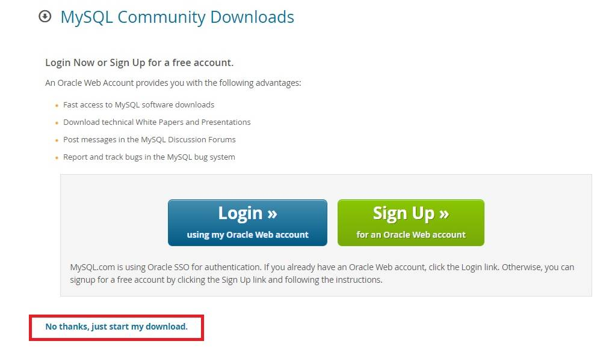
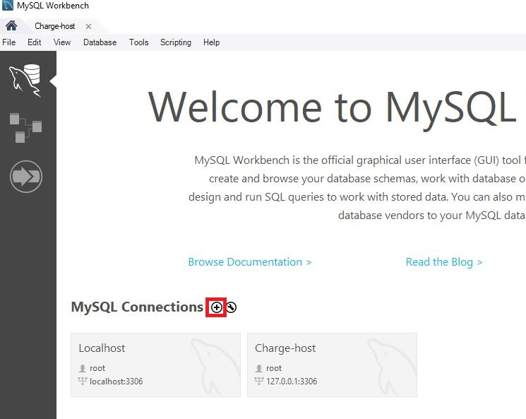
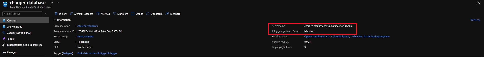

## MySQL setup

To set up a SQL database, perform the following steps:

1. Download MySQL workbench 8.0.27. To do so, go to the MySQL devs' website, click download now, choose the os you are using,  
make sure the version is 8.0.27 (This might be irrelevant due to future updates. Just choose the latest version) and click download.  
Now choose the "just download" option and then just click next until the program installs.
- 

2. Open MySQL workbench and create a new connection.
    - 
    - Name the connection something appropriate and then left click the connection.

3. Run the following SQL codes to create the database with the correct settings.
    - CREATE DATABASE findchargers;
    - Use findchargers;
    - CREATE TABLE charger(
        - id INTEGER NOT NULL UNIQUE PRIMARY KEY AUTO_INCREMENT,
        - address VARCHAR(100) NOT NULL,
        - coordinate_lat float,
        - coordinate_long float,
        - ac_1 BOOL,
        - ac_2 BOOL,
        - chademo BOOL,
        - ccs BOOL,
        - user_input VARCHAR(300)
    - );

    - CREATE TABLE email(
        - id INTEGER UNIQUE NOT NULL AUTO_INCREMENT,
        - email_address VARCHAR(100) NOT NULL,
        - FOREIGN KEY(id) REFERENCES charger(id) ON DELETE CASCADE
    - );

4. Now you will need to create an Azure database to host the MySQL database. That process is detailed in [Azure.md](Azure.md).

5. Next up is connecting the MySQL database to Azure. To do this, go into the Azure database and find the servername and username.  
Copy them and edit the connection you created in step 2 and input servername into hostname and Azure username into connection username.  
Testing this connection should return successfully but we are still not done.
    - 

6. Go to server parameters in the Azure database, search for require_secure_transport and switch it off.