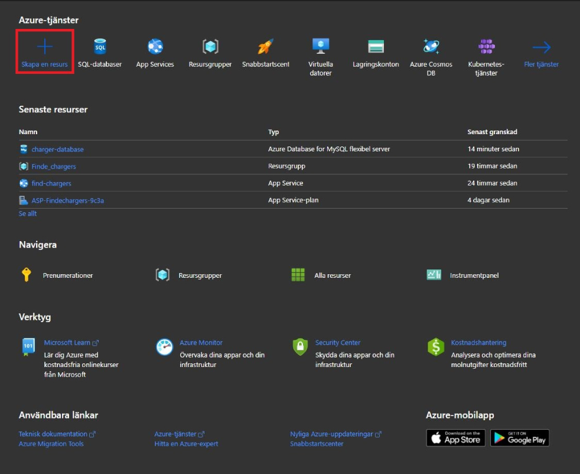
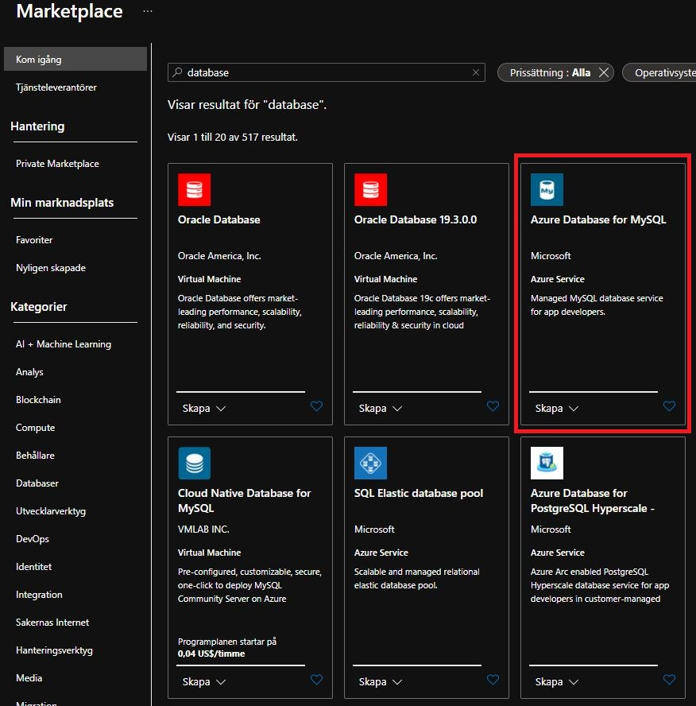
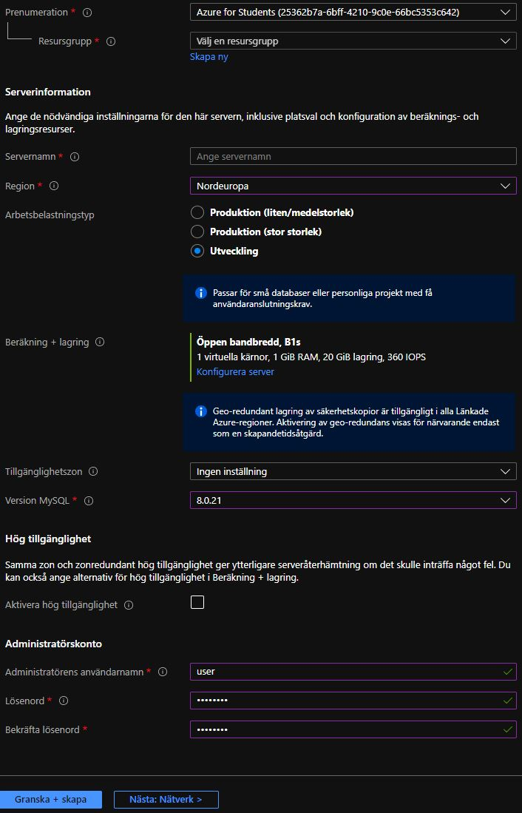

## Azure setup

If the project already has an app service in Azure you only need to get invited to the project and log in to your account. 

The following numbered list explains how to make an App Service. Skip these steps if there already is an App service in the project.
1. Log in to Azure in your browser
2. Press Create a resource
3. select Web app. 
4. Select a subscription 
5. Create a new resource group
6. Enter a name for the App service
7. Choose runtime stack for the language you are coding in (In our case we chose Node)
8. Choose operating system
9. Choose your most relevant region
10. Create a new Service plan
11. Press Review + Create
12. Finally press Create

Once you have your app service set up you can download the vs code extension "Azure App Service". 
    Extension ID: ms-azuretools.vscode-azureappservice
Press the new Azure logo in the vs code sidebar and then log in to your microsoft account that you used for Azure.

You can find the uploaded files in the Files tab under the project name in App Service. 

To manually upload files press the "Deploy to web app" cloud icon in the Azure extension on the App Service tab. 
There is also a github workflow that automatically uploads to azure when there is a push to main.

### Azure database for MySQL

To host the MySQL database created in [MySQL-setup.md](MySQL-setup.md) you need to create an Azure database for MySQL.

The following steps explain the process.
1. Click create a resource from the Azure homepage as shown below (Yes Azure has a dark mode, use it.) and input "database" into the search bar.
    - 
2. Select Azure database for MySQL, select create and create a flexible server.
    - 
3. Next fill in the following settings but insert your own resource group, username and password. A firewall rule must be generated by adding client ip. This can also be done later.
    - 
4. Create and review the database. Once you have confirmed this action the database will construct itself, which will take some time.